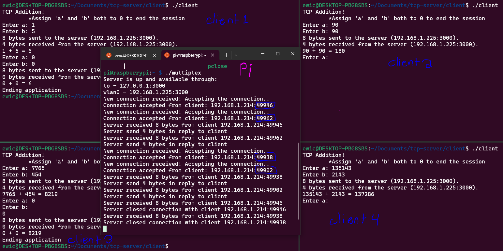

# tcp-server
**TCP multipexing server and client in `C`**
- Create a multiplexing TCP server
    - Where multiplexing means the ability to handle `n` number of clients at the same time

#### Raspberry Pi Serving 4 Clients


- Running `multiplex.c` on a Raspberry Pi Zero W
- Running 4 instances of `client.c` on a desktop

```
                     +------+      +------+
                     |  C2  |      |  C3  |
                     +------+      +------+
                          \          /
                           \        /
                         (WiFi) (WiFi)
                             \    / 
                              \  /
+------+        ____         +-----+        ____        +------+
|  C1  |----> ( WiFi )-----> |  S  | <----( WiFi ) <----|  C4  |
+------+       ```````       +-----+       ```````      +------+
```
Client and server based model
- The server is any machine which receives the request, and optionally returns back the result
- Client is any machine which initiates the request

## Setup

### Server (to run on Raspberry Pi)
- Update the port defined in `multiplex.c` (the port the server will listen to)
- scp `multiplex.c` to the Raspberry Pi
```bash
scp multiplex.c pi@192.168.1.225:~/.
``` 
- Enter the Raspberry Pi
- Confirm the Pi is up-to-date
```bash
sudo apt update
sudo apt upgrade
sudo apt install gcc
sudo apt install build-essential
```
- Build `multiplex.c` then run the program!
``` bash
gcc multiplex.c -o multiplex
./multiplex
```
- Now waiting for clients to connect

### Client
- Update the server IP address and port defined in `client.c`
- Build the `client.c` program with the makefile in the same directory (`make`)
- Run the program with `./client`
- Provide 2 integers for *a* and *b*
    - The server will return the sum of *a* and *b*
- Enter **0** for both *a* and *b* **to exit the client program**

## Socket Programming

- Linux OS provides2 system calls to enable us to write efficient network applications:
    1. `select()`
    2. `accept()`
- In C it is difficult to write a socket based application without the use of Select and Accept system calls

| Msg type | Client side API | Server side API |
| ------ | ---------| -------- |
| Connection initiation request messages | `connect()` | `accept()` |
| Service request messages | `sendmsg()`, `sendto()` | `recvmsg()`, `recvfrom()` |


### Server Designing
- Messages (or requests) sent by the client to the server can be categorized into 2 types:
    1. Connection inititation request messages
        - This message is used by the client to request the server to establish a dedicated connection
        - Only after the connection has been established, the client can send Service request messages to the server
    2. Service Request messages
        - Client can send these messages to server once the connection is fully established
        - Client requests server to provide a service

### Lifecycle of a Server
- When a server boots up, it creates a **master socket** using `socket()`
    - Master socket (M) has special privileges
    - M is the mother of all client handles
        - M gives birth to all Client handles
    - `accept()` is the system call used on the server side to create client handles
- A client handle is created by the server and master socket from a connection initiation request
- Once the client handles are created for each client, the Server carries out communication with the client using the client handle
    - The master socket is only used for new connection requests
    - M is not used for data exchange with already connected clients
- The server can service one client at a time (single thread)
    - but can maintain multiple connections
    - To handle more clients, more server machines need to be deployed

### `socket` System Call
- Creates a socket and returns the file descriptor integer for the one created
- Used to a create a TCP/UDP master socket
- Used on the server and client side
```c
socket(int __domain, int __type, int __protocol)
```
- socket takes 3 arguments
    - `__domain` = `AF_INET`: `AF_NET` specifies the address family and INET is for IPv4 address
    - `__type` = `SOCK_STREAM`: `SOCK_STREAM` used for creating TCP connections
        - For creating a UDP stream this arg would've been `SOCK_DGRAM`
    - `__protocol` = `IPPROTO_TCP`: `IPPROTO_TCP` is the protocol desired to run on top of the network layer
        - For creating a UDP stream this arg would've been `IPPROTO_UDP`

### `bind` System Call
- The server program (running in Applciation Layer) tells the OS to send packets it receives if it matches the server's IP address and port
- Used on the TCP/UDP server side
- Used by the server application process to inform the OS the criteria of packets of interest
```c
bind(int __fd, __CONST_SOCKADDR_ARG __addr, socklen_t __len)
```
- bind takes 3 arguments
    - `__fd` takes the "master" FD
    - `__addr` takes a pointer to the `sockaddr` struct of server info
    - `__len` takes the length of the `sockaddr` apssed in the 2nd arg

### `listen` System Call
- Used to limit the number of allowed incoming connections to be queued
- Do not want the system to get overwhelmed with simultaneous requests from a large number of requirements
- Used on the TCP/UDP server side
- Informs the OS the length of queue of incoming connection/data request from clients
```c
listen(int __fd, int __n)
```
- Takes 2 arguments:
    - `__fd` takes the "master" FD
    - `__n` is the length of the queue

### `accept` System Call
- The purpose of accept is to establish the connection between 2 machines (client and server)
- Carry out TCP 3-way handshake
- Used on TCP server side
- UDP connections do not use accept
- `accept` returns the handle to the connection with the client
    - The handle is just an integer value, representing a dedicated connection
- The handle is called a **communication file descriptor**
    - Because in Unix everything is a file
    - and the file descriptor is a non-negative integer to an open file or I/O resource
    - Treating the socket connection as an I/O stream allows aplications to use the same functions (`read`, `write`, `close`) for files and network sockets

```c
int comm_sock_fd = accept(master_sock_tcp_fd, (struct sockaddr*)&client_addr, &addr_len)
```
- `master_sock_tcp_fd`: the server creates this master socket on startup
    - This is the integer file descriptor for the master socket
- `client_addr`: pointer to the struct of type `sockaddr`
    - The struct is defined by standard C API
    - This is an empty structure that is passed by reference
    - It gets populated with the new client's identity (IP address and TCP port number)
- `addr_len`: size of predefined struct `sockaddr` (const)

### `select` System Call
- Implementing a server with multiplexing capabilities requires use of `select`
- Linux provides a built-in data structure to maintain the set of socket file descriptors
    - `fd_set` data structure is a set of file descriptors
- `select()` system call monitors all socket FDs present in `fd_set`
- it blocks code execution until either of the 2 options happens:
    1. New connection request from a client arrives
    2. Data request from existing connected client arrives

### `recvfrom` System Call
- Used on UDP server and client side
- Used by the server/client to read the data arrived on communication FDs
#### Example
```c
sent_recv_bytes = recvfrom(
    sockfd,
    (char *)&result,
    sizeof(result_data),
    0,
    (struct sockaddr*)&source,
    sizeof(struct sockaddr)
);
```
- `int sockfd`: the file descriptor to receive data from
- `result_data result`: the data structure (buffer) to have the received data read to
- `sizeof(result_data)`: The available space in the buffer
- `0`: providing no flags
- `struct sockaddr_in source`: the structure to be populate with the senders IP and port
- `(struct sockaddr*)&source`: the size of the sockaddr structure to store senders address info

#### Use `recvfrom` for connectionless protocols
- **For TCP use `recv` instead!**
    - Does the same thing as recvfrom except it does not populate the senders address info
    - For conenciton-oriented protocols like TCP the senders address info is not sent with the data packets!
        - So `recvfrom` will NOT get the senders address info if it is a TCP packet
- For TCP (connection-oriented) protocols the senders address info is sent and captured during `accept`
    - When the connection (3-way handshake) is being established

### `sendto` System Call
- Used on TCP/UDP server and client side
- Sends data to the client/server

### `close` System Call
- Closes the connection
- Used on TCP server and client side


#### Example
- A client (C1) makes a new connection request to the server
- The connection request goes through the master socket
- The server then creates a **handle** for the new connection to C1
    - The master socket is used to create this handle from the connection request
    - A handle is an object created by the server that is used to carry out all communication between the client and server
    - The handle is just an object that represents a connection with a client and the server
- The created handle is then used to handle the service request messages sent from the client
    - The handle only processes the service request messages from the client it is conencted with
- The handle then (optionally) sends a service response back to the client

#### Linux Terminology
- handles = file descriptors
- client handles = communication file descriptors
- M = master socket file descriptor


# Compile for Pi
- Install the cross-compiler toolchain for ARM architecture on your Ubuntu system
### Init Raspberry Pi
- Run the following commands on the Raspberry Pi to make sure it is up to date
```bash
sudo apt update
sudo apt upgrade
sudo apt install gcc
sudo apt install build-essential
``` 
## Split Windows Terminal Into 4 Panes
- `Shft` + `Alt` + `-`: split focused terminal horizontally
- `Shft` + `Alt` + `=`: split focused terminal vertically
